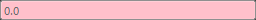
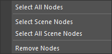

# Attribute Lister

This tool allows you to change the state of node attributes.

## Overview

This tool allows you to change the state of node attributes.
Mainly, you can lock attributes, change the display state of nodes, and modify attribute values.

## How to Use

You can launch the tool from the dedicated menu or by using the following command:

```python
import faketools.tools.attribute_lister
faketools.tools.attribute_lister.show_ui()
```


### Basic Usage

1. Select nodes (multiple selection is possible).
2. Press the `Load` button to load the selected nodes into the upper list. If you hold down the `Shift` key while selecting, the nodes will be added to the list.
3. Select the nodes loaded in the list (multiple selection is possible). The attributes of the selected nodes will be displayed in the lower list.
4. Select the attributes you want to change (multiple selection is possible).
5. Enter a value in the field at the bottom and press the `Enter` key to change the value of the selected attributes.

### Conditions for Changing Values

The conditions for changing values are as follows.  
If the value can be changed, the field will be displayed as shown below.


#### Unlocked Attributes

Unlocked attributes. If any of the selected nodes or attributes are locked, the value cannot be changed.
If locked, the field will be grayed out.


#### Attributes Without Connections

Attributes without connections. If any of the selected nodes or attributes have connections, the value cannot be changed.  
If there are connections, the field will be displayed in yellow.


#### Attributes of the Same Type

Attributes of the same type. If any of the selected nodes or attributes are of a different type, the value cannot be changed.
If there are attributes of different types, the field will be displayed in red.



### Changing the State of Nodes

Right-click on the attribute list to display a menu for changing the state of nodes.


You can perform the following operations on the attributes of the selected nodes:

- **Lock**  
  - Lock the selected attributes.
- **Unlock**  
  - Unlock the selected attributes.
- **Keyable**  
  - Display the selected attributes in the channel box.
- **Unkeyable**
  - Hide the selected attributes from the channel box.

### Selecting Nodes

Right-click on the node list to display a menu for selecting nodes.



- **Select Nodes(s)**
  - Select the selected nodes in the scene.
- **Select All Nodes**
  - Select all nodes loaded in the list in the scene.
