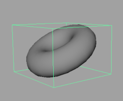
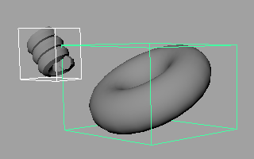

# BoundingBox Creator

選択したジオメトリに対してバウンディングボックス用のジオメトリを作成するツールです。

## 概要

選択したジオメトリに対してバウンディングボックス用のジオメトリを作成するツールです。
それぞれ、ワールド座標系、最小体積、軸に沿った最小体積のバウンディングボックスを作成することができます。

また、作成されたバウンディングボックスは、Translate、Rotate、Scale の値を保持します。





## 使用方法

専用のメニューか、以下のコマンドでツールを起動します。

```python
import faketools.tools.boundingbox_creator_ui
faketools.tools.boundingbox_creator_ui.show_ui()
```


### 基本的な使用方法


1. バウンディングボックスを作成したいジオメトリを選択します ( 複数選択可 )。また、グループノード ( transform ) を選択すると、その子も含めたバウンディングボックスを作成します。  

    

   
2. 作成するバウンディングボックスのタイプを選択します。
   - `World`: ワールド座標系でバウンディングボックスを作成します。
   - `Minimum`: 最小体積のバウンディングボックスを作成します。
   - `AxisAligned`: 指定した軸を基準として最小体積のバウンディングボックスを作成します。
     - `Axis Direction`: 軸の方向を指定します。
     - `Axis`: `Axis Direction` で指定した軸を最終的にどの軸に変換するかを指定します。
     - `Sampling`: バウンディングボックスのサンプリング数を指定します。値が大きいほど精度は上がりますが、計算量が増えます。
  
    

3. 作成されるバウンディングボックスジオメトリのタイプを選択します。
   - `mesh`: Cube メッシュをバウンディングボックスとして作成します。
   - `curve`: Cube 型のカーブをバウンディングボックスとして作成します。
   - `locator`: ロケーターをバウンディングボックスの位置に作成します。
  
    

4. オプションを設定します。

5. `Create` ボタンを押してバウンディングボックスを作成します。  

    

### オプション

- `Base Line`: 作成されるバウンディングボックスのピボット位置を指定します。
- `Include Scale`: ジオメトリのスケールをバウンディングボックスに反映します。オフの場合は、スケール値を無視します。
- `Parent`: 作成されるバウンディングボックスを選択したノードの親として作成します。


