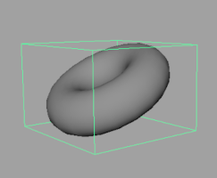
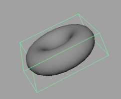
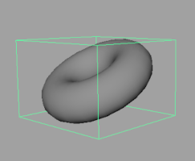
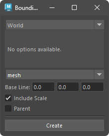
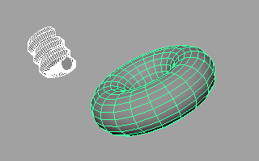
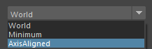
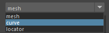
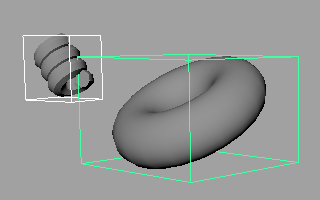

# BoundingBox Creator

This tool creates geometry for bounding boxes for the selected geometry.

## Overview

This tool creates geometry for bounding boxes for the selected geometry.
You can create bounding boxes in world coordinates, minimum volume, and minimum volume aligned to an axis.

Additionally, the created bounding boxes retain the values of Translate, Rotate, and Scale.





## Usage

Launch the tool from the dedicated menu or with the following command:

```python
import faketools.tools.boundingbox_creator_ui
faketools.tools.boundingbox_creator_ui.show_ui()
```



### Basic Usage

1. Select the geometry for which you want to create a bounding box (multiple selections are allowed). If you select a group node (transform), it will create a bounding box including its children.

    

2. Select the type of bounding box to create.
   - `World`: Creates a bounding box in world coordinates.
   - `Minimum`: Creates a bounding box with the minimum volume.
   - `AxisAligned`: Creates a bounding box with the minimum volume aligned to the specified axis.
     - `Axis Direction`: Specifies the direction of the axis.
     - `Axis`: Specifies which axis to convert the `Axis Direction` to.
     - `Sampling`: Specifies the number of samples for the bounding box. The higher the value, the higher the accuracy, but the higher the computational cost.

    

3. Select the type of geometry for the bounding box to create.
   - `mesh`: Creates a cube mesh as the bounding box.
   - `curve`: Creates a cube-shaped curve as the bounding box.
   - `locator`: Creates a locator at the position of the bounding box.

    

4. Set the options.

5. Press the `Create` button to create the bounding box.

    

### Options

- `Base Line`: Specifies the pivot position of the created bounding box.
- `Include Scale`: Reflects the scale of the geometry in the bounding box. If off, the scale value is ignored.
- `Parent`: Creates the bounding box as a parent of the selected node.
