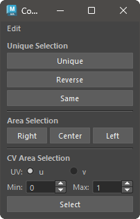
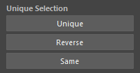

# Component Selecter

コンポーネントの選択補助ツールです。

## 概要

Vertex、NurbsCurveCV、NurbsSurfaceCV、LatticePoint の選択を補助するツールです。
主に以下の機能を提供します。

- SoftSelection、SymmetrySelection 状態のコンポーネントを再選択
- 選択の反転
- メッシュと同位置のコンポーネントを選択
- コンポーネントのエリア選択
- CV のエリア選択

各コンポーネントはそのジオメトリをまたがり複数選択可能です。

## 使用方法

専用のメニューか、以下のコマンドでツールを起動します。

```python
import faketools.tools.component_selecter_ui
faketools.tools.component_selecter_ui.show_ui()
```



### Unique Selection

コンポーネントをいろいろな方法で選択しなおします。



#### Unique

選択したコンポーネントを SoftSelection、SymmetrySelection 状態から再選択します。

選択するには、以下の手順を行います。

1. SoftSelection、SymmetrySelection モードでコンポーネントを選択します。
2. `Unique` ボタンを押します。

※ Edit メニューの `Toggle Soft Selection` と `Toggle Symmetry Selection` で各モードを切り替えることができます。


#### Reverse

選択したコンポーネントを反転します。

#### Same

メッシュと同位置のコンポーネントを選択します。

選択するには、以下の手順を行います。

1. メッシュを選択します。
2. コンポーネントを追加選択します。
3. `Same` ボタンを押します。

#### Area Selection


コンポーネントのエリア選択を行います。YZ 平面を軸としてそれぞれ 右、左、真ん中のエリア選択が可能です。

選択するには、以下の手順を行います。

1. geometryShape の派生ノードかそのトランスフォームノードを選択します ( 複数選択可 )。
2. 選択したいエリアのボタン ( `Right`, `Center`, `Left` ) を押します。

#### CV Area Selection


CV のエリア選択を行います。

選択するには、以下の手順を行います。

1. nurbsCurve、nurbsSurface の派生ノードかそのトランスフォームノードを選択します ( 複数選択可 )。
2. nurbsSurface の場合は、`u` または `v` の方向を選択します。
3. **max** と **min** スピンボックスで選択範囲を指定します。
4. `Select` ボタンを押します。

例えば、nurbsCurve を選択し、**max** に 2、**min** に 0 を入力して `Select` ボタンを押すと、CV の 0 から 2 までが選択されます。


