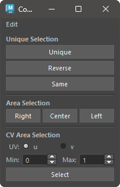
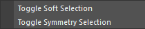
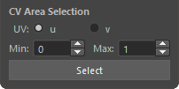

# Component Selector

This is a tool to assist with component selection.

## Overview

This tool assists in the selection of Vertex, NurbsCurveCV, NurbsSurfaceCV, and LatticePoint components.
It mainly provides the following features:

- Reselect components in SoftSelection and SymmetrySelection states
- Invert selection
- Select components at the same position as the mesh
- Area selection of components
- Area selection of CVs

Each component can be selected across multiple geometries.

## Usage

Launch the tool from the dedicated menu or with the following command:

```python
import faketools.tools.component_selecter
faketools.tools.component_selecter.show_ui()
```



### Unique Selection

Re-select components in various ways.


#### Unique

Reselect the selected components from SoftSelection and SymmetrySelection states.

To select, follow these steps:

1. Select components in SoftSelection or SymmetrySelection mode.
2. Press the `Unique` button.

*You can toggle each mode with the `Toggle Soft Selection` and `Toggle Symmetry Selection` options in the Edit menu.*



#### Reverse

Invert the selected components.

#### Same

Select components at the same position as the mesh.

To select, follow these steps:

1. Select the mesh.
2. Add the components to the selection.
3. Press the `Same` button.

#### Area Selection


Perform area selection of components. You can select the right, left, or center area based on the YZ plane.

To select, follow these steps:

1. Select the derived node of the geometryShape or its transform node (multiple selections allowed).
2. Press the button for the desired area (`Right`, `Center`, `Left`).

#### CV Area Selection



Perform area selection of CVs.

To select, follow these steps:

1. Select the derived node of the nurbsCurve or nurbsSurface or its transform node (multiple selections allowed).
2. For nurbsSurface, select the direction (`u` or `v`).
3. Specify the selection range with the **max** and **min** spin boxes.
4. Press the `Select` button.

For example, if you select a nurbsCurve, enter 2 for **max** and 0 for **min**, and press the `Select` button, CVs from 0 to 2 will be selected.
