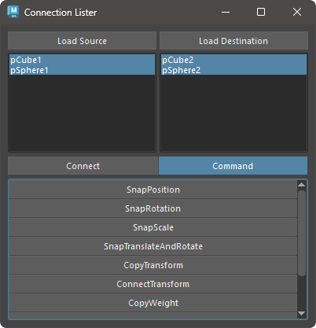

# Connection Lister

This tool is used to modify connections between nodes.

## Overview

This tool is used to copy values and modify connections between nodes.  
Additionally, you can perform specific operations on nodes using the provided commands.

## Usage

Launch the tool from the dedicated menu or with the following command:

```python
import faketools.tools.connection_lister
faketools.tools.connection_lister.show_ui()
```


### Basic Usage

The method for loading nodes and attributes is the same as **[Attribute Lister](./attribute_lister_en.html)**.  
Select a node and press the load button to display the attributes of that node in the list.

You can copy values and make connections in `Connect` mode.  
In `Command` mode, you can use the provided commands.

## Connect Mode

To copy a value, press the `Copy Value` button to copy the value of the attribute.  
To connect an attribute, press the `Connect` button to connect the attribute.

#### Selecting Nodes and Attributes

You can select nodes and attributes displayed in the list by selecting the same number of lists on both sides,


or, as shown in the image, by having one source node and attribute and multiple target nodes and attributes.


## Command Mode

In `Command` mode, you can use the provided commands.

For commands, refer to the **Single Command** and **Pair Command** functionalities.  
Please refer to the **[Single Command](./single_commands.html_en)** documentation.




