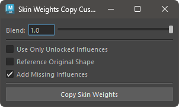

# Copy SkinWeights Custom

ウエイトのコピーをオプションを指定して行います。


## 使用方法

Skin Weights Utility のメニューを使用するか、以下のコマンドでツールを起動します。

```python
import faketools.tools.skinWeights_copy_custom
faketools.tools.skinWeights_copy_custom.show_ui()
```



### 基本的な使用方法

ウエイトをコピーするには、以下の手順を行います。

1. コピー元となるジオメトリを選択します。
2. コピー先となるジオメトリ（複数選択可）を選択します。
3. ウエイトのコピー方法を選択し、`Copy Skin Weights` ボタンを押します。

### オプション

- **Blend**
  - 指定した値の割合でウエイトをコピーします。
- **Use Only Unlocked Influences**
  - ロックされていないインフルエンスのみを使用してコピーします。
- **Reference Original Shape**
  - オリジナルシェイプ ( Intermediate Object ) を参照してコピーします。
- **Add Missing Influence**
  - コピー先に存在しないインフルエンスをコピー時に自動的に追加します。