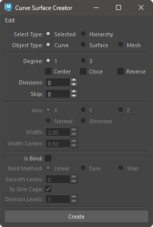
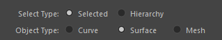
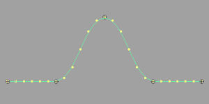
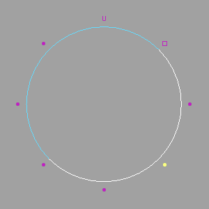
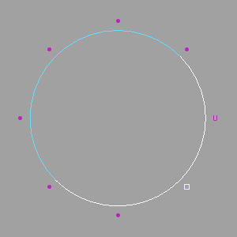

# CurveSurface Creator

Creates NURBS curves for selected transform nodes.

## Overview

Creates NURBS curves (hereafter referred to as curves) for selected transform nodes, and based on those curves, creates lofted NURBS surfaces (hereafter referred to as surfaces) or meshes.

Additionally, if joint nodes are selected, the created objects can be smooth bound using options.

## How to Use

Launch the tool from the dedicated menu or with the following command:

```python
import faketools.tools.curveSurface_creator
faketools.tools.curveSurface_creator.show_ui()
```



### Basic Usage

1. Select transform nodes (multiple selections possible).
2. Choose `Select Type` as either `Selected` (create between selected nodes) or `Hierarchy` (create for each hierarchy of selected nodes).
3. Select the type of object to create from `Object Type`.
4. Set the options that are not grayed out.
5. Press the `Create` button to create curves or surfaces.

## Options

The main options are divided into the following four categories:

* Basic Options
* Curve Options
* Loft Surface Options
* Bind Options

### Basic Options



* **Select Type**
  * Specifies how to select the transform nodes to create curves.
    * `Selected`: Create between selected nodes.
    * `Hierarchy`: Create for each hierarchy of selected nodes.
* **Object Type**
  * Specifies the type of object to create.
    * `Curve`: Create curves.
    * `Surface`: Create lofted surfaces based on curves.
    * `Mesh`: Create lofted meshes based on curves.

### Curve Options

Options to set when creating curves.


* **Degree**
  * Specifies the degree of the created curve.
* **Center**
  * Ensures the curve is created at the center of the selected nodes.
* **Close**
  * Ensures the curve is closed.
* **Reverse**
  * Reverses the direction of curve creation.
* **Divisions**
  * Specifies the number of divisions for the curve.
* **Skip**
  * Skips the specified number of selected nodes when creating the curve.

### Loft Surface Options

Options to set when creating surfaces or meshes. Only valid when `objectType` is `Surface` or `Mesh`.


* **Axis**
  * Specifies the direction of surface creation.
    * `X`: Create surfaces in the X-axis direction of the selected nodes.
    * `Y`: Create surfaces in the Y-axis direction of the selected nodes.
    * `Z`: Create surfaces in the Z-axis direction of the selected nodes.
    * `Normal`: Create surfaces in the normal direction of the curve.
    * `Binormal`: Create surfaces in the binormal direction of the curve.
* **Width**
  * Specifies the width of the surface.
* **Width Center**
  * Creates the surface centered on this value in the specified direction. At 0.5, the surface will have equal width on both sides.
  * For example, if Width is 10.0 and Width Center is 0.5, the surface will range from -5.0 to 5.0.

### Bind Options

Options for smooth binding the created objects to the selected nodes. Only valid if the selected nodes are joint nodes.


* **Is Bind**
  * When this checkbox is on, the created objects are smooth bound to the selected nodes.
* **Bind Method**
  * Specifies the method for smooth binding.
    * `Linear`: Bind with linear weights.

      

    * `Ease`: Bind with ease-in-out weights.
    
      

    * `Step`: Bind with step weights.
    
      

* **Smooth Levels**
  * Specifies the level of smoothing for weights after setting weights with `Bind Method`.
* **To Skin Cage**
  * Converts the smooth bound object to a skin cage, similar to the **Skin Weights to Mesh** tool. Only valid when `objectType` is `Surface`.
* **Division Levels**
  * Specifies the number of divisions for the skin cage when `To Skin Cage` is on.

## Edit Menu

Commands used to create/edit curves are stored here.

### Move CVs Positions

* Select one CV of a closed curve and execute.
* Moves the CV position 0 to the selected CV position.

 

### Create Curve to Vertices

* Select vertices (mesh vertices) and execute (multiple selections possible).
* Creates a curve based on the selected vertices.
  
 
