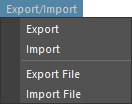

# DrivenKey Tools

セットドリブンキーの編集を補助するツールです。

## 概要

セットドリブンキーの編集を補助するツールです。

セットドリブンキーに対して主に以下の機能を提供します。

- 保存と読み込み
- コピーとペースト
- アニメーションカーブのミラー
- いくつかのユーティリティー機能


## 使用方法

専用のメニューか、以下のコマンドでツールを起動します。

```python
import faketools.tools.drivenkey_tools
faketools.tools.drivenkey_tools.show_ui()
```


### セットドリブンキーの保存と読み込み

セットドリブンキーのファイルへの保存、また、保存したファイルからの再現を行います。  
**Quick** モードと **Advanced** モードがあります。




セットドリブンキーのファイルへの保存を行うには、以下の手順を行います。

1. セットドリブンキーが設定されたノードを選択します ( 複数選択可 )。

2. **Export** ボタンを押して、データを保存します。
   1. **Quick** モードでは、TEMP フォルダに一時的にファイルを保存します。
   2. **Advanced** モードでは、任意の場所にファイルを保存します。ファイル名を入力して `Save` ボタンを押します。
   
セットドリブンキーのファイルを読み込むには、以下の手順を行います。

1. **Import** ボタンを押して、保存したファイルを読み込みます。
   1. **Quick** モードでは、TEMP フォルダに保存されたファイルを読み込みます。
   2. **Advanced** モードでは、読み込むファイルを選択して `Open` ボタンを押します。

2. ファイルに保存されたセットドリブンキーが再現され、適応先のノードが選択されます。

### セットドリブンキーのコピーとペースト

セットドリブンキーのコピーとペーストを行います。  
**One to All** と **One to Replace** の二つの方法があります。


#### One to All ( 一つから全てへ )

一つのノードのセットドリブンキーを、複数のノードにコピーします。

コピーするには、以下の手順を行います。

1. コピー元のノードを選択します。
2. コピー先のノードを追加選択します ( 複数選択可 )。
3. `One to All` ボタンを押します。

#### One to Replace ( 置換後のノードへ )

一つのノードのセットドリブンキーを、そのノード名を置換したノードをシーンから検索してコピーします。  
ノード名の置換には、`One to Replace` ボタン下のフィールドを使用します。 ( python の正規表現で置換されます。 )

コピーするには、以下の手順を行います。

1. コピー元のノードを選択します ( 複数選択可 )。
2. `One to Replace` ボタンを押します。置換後のノードがシーンから検索され、コピーされます。

- **Replace Driver**
  - ドライバーのノード名も置換したものを使用します。
- **Force Delete Driven Key**
  - 置換後のノードに既にセットドリブンキーが設定されている場合、適応するドリブンキー以外もすべて削除し、コピーします。
- **Mirror**
   - 置換後のノードに対して、T ( Translate ) R ( Rotate ) S ( Scale ) のアニメーションカーブを **Time** か **Value** 方向にミラーします。

### アニメーションカーブのミラー

アニメーションカーブのミラーを行います。


ミラーを行うには、以下の手順を行います。

1. ミラーを行いたいドリブンキーアニメーションカーブを選択します ( 複数選択可 )。
2. `Time` か `Value` ボタンを押します。
   - `Time` ボタンを押すと、アニメーションカーブの時間方向にミラーします。
   - `Value` ボタンを押すと、アニメーションカーブの値方向にミラーします。


### オプション

いくつかの追加機能があります。


- **Select Driven Key Nodes**
  - セットドリブンキーが設定されたノードを選択します。
    - 既にノードがシーン上で選択されている場合、そのノード内のセットドリブンキーが設定されたノードを選択します。
    - 何も選択されていない場合、シーン上のすべてのノード内のセットドリブンキーが設定されたノードを選択します。
- **Cleanup Driven Key**
   - セットドリブンキーが設定されているノードをクリーンアップします。以下の状況を整理します。
     - ドライバーが存在しないドリブンキーを削除します。
     - 値がすべて同じであり、またタンジェントの値がすべて 0.0 であるドリブンキーを削除します。
     - 以上の条件を満たし、削除した後に blendWeighted ノードに animCurve が接続されていないかひとつだけ接続されている場合は、その blendWeighted ノードを削除します。
     - とにかくきれいにします。
  
