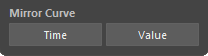
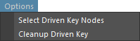

# DrivenKey Tools

This tool assists in editing set driven keys.

## Overview

This tool assists in editing set driven keys.

It mainly provides the following functions for set driven keys:

- Save and Load
- Copy and Paste
- Mirror Animation Curves
- Several Utility Functions

## How to Use

Launch the tool from the dedicated menu or with the following command:

```python
import faketools.tools.drivenkey_tools
faketools.tools.drivenkey_tools.show_ui()
```


### Save and Load Set Driven Keys

Save set driven keys to a file and reproduce them from the saved file.


To save set driven keys to a file, follow these steps:

1. Select the node with the set driven keys (multiple selections allowed).

2. Select `Export` or `Export File` from the `Export/Import` menu.
   - `Export` saves to the TEMP folder.
   - `Export File` allows you to choose the save location.

To load set driven keys from a file, follow these steps:

1. Select `Import` or `Import File` from the `Export/Import` menu.
   - `Import` loads from the TEMP folder.
   - `Import File` allows you to choose the file to load.

2. The set driven keys saved in the file will be reproduced, and the target nodes will be selected.

### Copy and Paste Set Driven Keys

Copy and paste set driven keys.  
There are two methods: **One to All** and **One to Replace**.


#### One to All

Copy the set driven keys from one node to multiple nodes.

To copy, follow these steps:

1. Select the source node.
2. Add the target nodes to the selection (multiple selections allowed).
3. Press the `One to All` button.

#### One to Replace

Copy the set driven keys from one node to nodes found in the scene with replaced names.  
Use the field below the `One to Replace` button for name replacement (replaced using Python regular expressions).

To copy, follow these steps:

1. Select the source node (multiple selections allowed).
2. Press the `One to Replace` button. The nodes with replaced names will be found in the scene and copied.

- **Replace Driver**
  - Use the replaced name for the driver node as well.
- **Force Delete Driven Key**
  - If the target node already has set driven keys, delete all driven keys except the ones being applied, then copy.
- **Mirror**
   - Mirror the T (Translate), R (Rotate), and S (Scale) animation curves of the target node in the **Time** or **Value** direction.

### Mirror Animation Curves

Mirror animation curves.



To mirror, follow these steps:

1. Select the driven key animation curves you want to mirror (multiple selections allowed).
2. Press the `Time` or `Value` button.
   - Press the `Time` button to mirror the animation curves in the time direction.
   - Press the `Value` button to mirror the animation curves in the value direction.

### Option Menu

There are several additional functions.



- **Select Driven Key Nodes**
  - Select nodes with set driven keys.
    - If nodes are already selected in the scene, select the nodes with set driven keys within those nodes.
    - If nothing is selected, select all nodes with set driven keys in the scene.
- **Cleanup Driven Key**
   - Clean up nodes with set driven keys. Organize the following situations:
     - Delete driven keys with non-existent drivers.
     - Delete driven keys where all values are the same and all tangent values are 0.0.
     - If the above conditions are met and after deletion, the blendWeighted node has no animCurve connected or only one connected, delete the blendWeighted node.
     - Clean up thoroughly.
