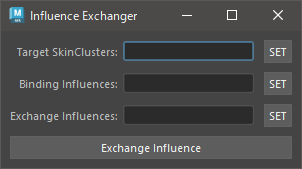

# Influence Exchange

既にバインドされているインフルエンスをバインドされていないインフルエンスに交換します。

## 使用方法

Skin Weights Utility のメニューを使用するか、以下のコマンドでツールを起動します。

```python
import faketools.tools.influence_exchanger
faketools.tools.influence_exchanger.show_ui()
```



### 基本的な使用方法

インフルエンスを交換するには、以下の手順を行います。

1. `Target SkinClusters` に交換対象のスキンクラスタを選択し、`SET` ボタンを押します。
2. `Binding Influences` に交換元のインフルエンスを選択し、`SET` ボタンを押します。ここに設定されるインフルエンスはすべて、`Target SkinClusters` に設定されたスキンクラスタにバインドされている必要があります。
3. `Exchange Influences` に交換先のインフルエンスを選択し、`SET` ボタンを押します。ここに設定されるインフルエンスはすべて、`Target SkinClusters` に設定されたスキンクラスタにバインドされていない必要があります。
4. `Exchange Influences` ボタンを押します。