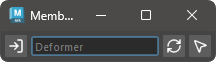

# Transform Creator

Edit the membership of deformers. Available only when component tag settings are enabled.

Only deformers of the WeightGeometryFilter type are targeted.

## How to Use

Launch the tool from the dedicated menu or with the following command:

```python
import faketools.tools.membership_handler_ui
faketools.tools.membership_handler_ui.show_ui()
```



### Conditions for Launch

This tool is available only when component tags are enabled.

Enable component tags with the following settings:

1. Navigate to `Preferences` > `Settings` > `Animation`.
2. In the `Rigging` section, configure the following three settings:
    - Check `Use component tags for deformation component subsets`.
    - Check `Create component tags on deformer creation`.
    - Uncheck `Add tweak nodes on deformer creation`.

### Basic Usage

1. Select the deformer to edit and press the  button.  
  
*Note: In the image, the handle of the cluster deformer is selected, but in reality, select the deformer itself and press the button.*

1. The name of the selected deformer will be displayed in the middle field.  


1. Press the  button to select the membership registered to that deformer.  


1. Select the components you want to update and press the  button to update the membership.  

