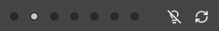
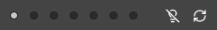
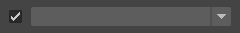

# Node Stocker

選択したノードを保存し、後で呼び出すことができるツールです。


## 使用方法

専用のメニューか、以下のコマンドでツールを起動します。

```python
import faketools.tools.node_stocker
faketools.tools.node_stocker.show_ui()
```


### 基本的な使用方法

ノードを保存、選択、クリアする方法を説明します。

### ノードを保存する

1. 保存したいノードを選択します。
2. 保存するエリアを選択します。エリアは上部のラジオボタンで決定します。 
  
    
    

3. 数字が書かれているボタンを中クリックすることで、そのボタンにノードを登録します。
    
    ボタンにノードが登録されると、ボタンの背景色が変わります。

    
    

### ノードを選択する

1. 選択したいエリアを選択します。
2. 背景色が変わっているボタンをクリックすることで、そのボタンに登録されたノードを選択します。

    **モディファイヤキーを使用しての選択** も可能です。選択のルールは Maya の View 上での選択と同じです。  
    また、エリア上で **短形選択** を行うことで、複数のボタンのノードを一度に呼び出すことができます。

### 保存したノードをクリアする

ボタン上で右クリックすることで、そのボタンに登録されたノードをクリアすることができます。

## オプション

### 登録されているノードをハイライトする

ボタン上をマウスオーバーすることで、そのボタンに登録されたノードを Maya の View 上でハイライトすることができます。
ハイライト表示するには、電球アイコンをオンにします。




アイコンをオンにして、ボタン上をマウスオーバーすると、ハイライト表示されます。


### ネームスペースを含めて選択する

ノードを呼び出す際に、ネームスペースを含めて選択するかどうかを設定できます。

ネームスペースを含めて選択するには、チェックボックスをオンにし、下部のドロップダウンメニューから目的のネームスペースを選択します。




※ 登録されているノードにネームスペースが存在しない場合は、そのノードにネームスペースを付与した形のノードを選択します。  
※ ノードがフルパスも含めて登録されている場合、そのノードの親のネームスペースも置換する仕様になっています。

### ノード名を置換して選択する

ノードを呼び出す際に、ノード名を置換して選択することができます。

ノード名を置換して選択するには、チェックボックスをオンにし、下部のテキストボックスに置換前のノード名と置換後のノード名を入力します。

**例：登録されているノードの surface を curve に置換する場合**


置換を逆転させるには、真ん中の矢印ボタンをクリックします。


また、一番左のボタンをチェックすると、置換を正規表現で行います。

**例: 登録されているノードの先頭に curve を追加する場合**


※ 正規表現モードではない場合、置換前となるテキストが必要です。

### ツールをリフレッシュする

ツールをリフレッシュするには、上部右端の **リフレッシュボタン** をクリックします。
登録されたノードがファイルから再ロードされ、また ネームスペースのリストも更新されます。


