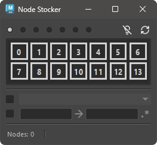
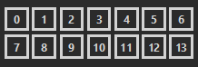
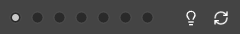
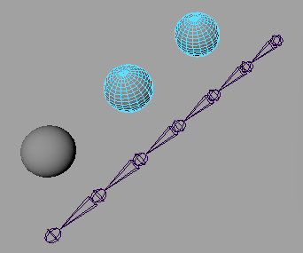
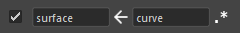

# Node Stocker

A tool that allows you to save selected nodes and recall them later.

## How to Use

Launch the tool from the dedicated menu or with the following command:

```python
import faketools.tools.node_stocker_ui
faketools.tools.node_stocker_ui.show_ui()
```



### Basic Usage

This section explains how to save, select, and clear nodes.

### Saving Nodes

1. Select the node you want to save.
2. Choose the area to save the node. The area is determined by the radio buttons at the top.

    
    

3. Middle-click the button with the number to register the node to that button.

    When a node is registered to a button, the background color of the button changes.

    
    

### Selecting Nodes

1. Select the area you want to choose.
2. Click the button with the changed background color to select the node registered to that button.

    **Using Modifier Keys for Selection** is also possible. The selection rules are the same as in Maya's View.  
    Additionally, you can perform **rectangular selection** on the area to call multiple nodes at once.

### Clearing Saved Nodes

Right-click on the button to clear the node registered to that button.

## Options

### Highlight Registered Nodes

Mouse over the button to highlight the node registered to that button in Maya's View.  
To enable highlighting, turn on the light bulb icon.




When the icon is on, mousing over the button will highlight the node.




### Include Namespace in Selection

You can set whether to include the namespace when calling nodes.

To include the namespace, turn on the checkbox and select the desired namespace from the dropdown menu at the bottom.


* If the registered node does not have a namespace, the node will be selected with the namespace added.
* If the node is registered with a full path, the parent namespace of the node will also be replaced.

### Replace Node Names in Selection

You can replace node names when calling nodes.

To replace node names, turn on the checkbox and enter the original and replacement node names in the text box at the bottom.

**Example: Replacing 'surface' with 'curve' in registered nodes**


Click the middle arrow button to reverse the replacement.



Also, check the leftmost button to perform the replacement using regular expressions.

**Example: Adding 'curve' to the beginning of registered node names**


* In non-regular expression mode, the original text is required for replacement.

### Refresh the Tool

To refresh the tool, click the **refresh button** at the top right.  
The registered nodes will be reloaded from the file, and the namespace list will be updated.


