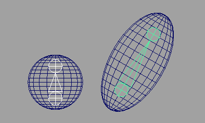

# Position Import/Export

選択したノードの位置情報をエクスポート、インポートするツールです。

## 概要

このツールは、選択したトランスフォームノードの位置や回転情報をファイルにエクスポート、インポートすることができます。  
いくつかの方法で位置情報を取得、設定することができます。方法は以下の通りです。

### Default

トランスフォームノードの位置情報をワールド位置で取得し、ワールド位置で再現します。

### Barycentric

トランスフォームノードの位置情報をそのノードから一番近い三角ポリゴンのバリセントリック座標で取得し、メッシュのバリセントリック座標で再現します。  
再現時は、同じトポロジーのメッシュを選択する必要があります。

トランスフォームノードがメッシュの表面上にある場合に、有効な方法です。

 

### Rbf

トランスフォームノードの位置情報を周りの Vertex 位置から取得し、同トポロジーのメッシュへ再現します。  
再現時は、同じトポロジーのメッシュを選択する必要があります。

トランスフォームノードがメッシュの内部にある場合に、有効な方法です。

 

## 使用方法

専用のメニューか、以下のコマンドでツールを起動します。

```python
import faketools.position_import_export
faketools.position_import_export.show()
```


### 基本的な使用方法

#### エクスポート

位置情報をエクスポートするには、以下の手順で行います。

1. `Method` からエクスポートする方法を選択します。  
  

1. 方法に応じて位置情報をエクスポートする対象のノードを選択します。  

     - `Default`  
       - エクスポートするトランスフォームノードを選択してください ( 複数選択可 )。
     - `Barycentric`  
       - エクスポートするメッシュ ( メッシュのトランスフォームノード ) を選択してください。
       - 追加でエクスポートするノードを選択してください ( 複数選択可 )。
     - `Rbf`  
       - エクスポートするメッシュ ( メッシュのトランスフォームノード ) を選択してください。
        - 追加でエクスポートするノードを選択してください ( 複数選択可 )。
    
2. `File Name` にエクスポートするファイル名を入力します。  
  

1. `Export` ボタンを押します。  
  エクスポートが完了すると、エクスポートしたファイル名がリストに表示されます。  
  

※ `Rbf` の方法を選択した時は、`Rbf Radius` の値でエクスポート時の半径を設定できます。位置を再現する際に目的の挙動と異なる場合は、この値を大きくすることで期待する挙動が得られる場合があります。

#### インポート

位置情報をインポートするには、以下の手順で行います。

1. インポートするファイル名をリストから選択します。  
  

2. エクスポートした時の方法に応じて、インポートする対象のノードを選択します。  
     - `Default`  
       - 選択の必要はありません。
     - `Barycentric`  
       - エクスポートした時と同トポロジーのメッシュを選択してください。
     - `Rbf`  
        - エクスポートした時と同トポロジーのメッシュを選択してください。

3. オプションを設定し、`Import` ボタンを押します。デフォルトの設定では、エクスポート時に選択したノードに位置情報が適用されます。  
  

### インポートオプション

インポート時に設定可能なオプションです。

- `Is Rotation`  
  - 回転情報をトランスフォームノードに適用するかどうかを設定します。
- `Create New`  
  - チェックボックスがオンの時、`Object Type` で選択したノードタイプで新規にトランスフォームノードを作成します。オフの場合は、エクスポート時に選択したノードに位置情報を適用します。
  - 選択したノードが一つでも存在しなければ、エラーメッセージが表示されます。
- `Object Type`  
  - `Create New` がオンの時に作成するトランスフォームノードのタイプを選択します。
- `Size`  
  - `Create New` がオンの時に作成するトランスフォームノードのサイズを設定します。
  
### コンテキストメニュー

リスト上で右クリックすると、コンテキストメニューが表示されます。


- `Select Nodes`  
  - リストで選択しているファイルに記録されているノードを選択します。
- `Remove File`  
  - リストで選択しているファイルを削除します。( 実際のファイルも削除されます。 )
- `Refresh`  
  - リストを更新します。
- `Open Directory`  
  - エクスポートしたファイルが保存されているフォルダを開きます。
