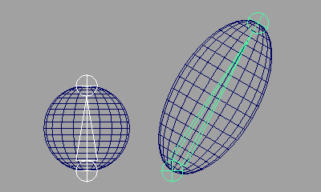
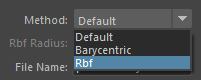
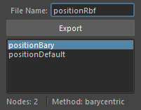
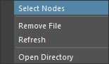

# Position Import/Export

This tool allows you to export and import the position information of selected nodes.

## Overview

This tool can export and import the position and rotation information of selected transform nodes to a file.  
You can obtain and set position information in several ways. The methods are as follows:

### Default

Obtain the position information of the transform node in world space and reproduce it in world space.

### Barycentric

Obtain the position information of the transform node in barycentric coordinates of the nearest triangle polygon from the node and reproduce it in the barycentric coordinates of the mesh.
When reproducing, you need to select a mesh with the same topology.

This method is effective when the transform node is on the surface of the mesh.

 

### Rbf

Obtain the position information of the transform node from a point cloud and reproduce it in the vertex coordinates of the mesh. When reproducing, you need to select a mesh with the same topology.

This method is effective when the transform node is inside the mesh.

 

## How to Use

Launch the tool from the dedicated menu or with the following command:

```python
import faketools.position_import_export
faketools.position_import_export.show()
```


### Basic Usage

#### Export

To export position information, follow these steps:

1. Select the export method from the dropdown menu at the top.  
  

2. Select the nodes to export according to the method.  

     - `Default`  
       - Select the transform nodes to export (multiple selections allowed).
     - `Barycentric`  
       - Select the mesh (transform node of the mesh) to export.
       - Additionally, select the nodes to export (multiple selections allowed).
     - `Rbf`  
       - Select the mesh (transform node of the mesh) to export.
       - Additionally, select the nodes to export (multiple selections allowed).
    
3. Enter the file name to export in `File Name`.  
  

4. Press the `Export` button.  
  Once the export is complete, the exported file name will be displayed in the list.  
  

#### Import

To import position information, follow these steps:

1. Select the file name to import from the list.  
  

2. Select the nodes to import according to the method used during export.  
     - `Default`  
       - No selection is required.
     - `Barycentric`  
       - Select a mesh with the same topology as when exported.
     - `Rbf`  
       - Select a mesh with the same topology as when exported.

3. Set the options and press the `Import` button. By default, the position information will be applied to the nodes selected during export.  
  

### Import Options

Options that can be set during import:

- `Is Rotation`  
  - Set whether to apply rotation information to the transform node.
- `Create New`  
  - When the checkbox is on, a new transform node of the type selected in `Object Type` will be created. When off, the position information will be applied to the nodes selected during export.
  - If even one of the selected nodes does not exist, an error message will be displayed.
- `Object Type`  
  - Select the type of transform node to create when `Create New` is on.
- `Size`  
  - Set the size of the transform node to create when `Create New` is on.
  
### Context Menu

Right-click on the list to display the context menu.



- `Select Nodes`  
  - Select the nodes recorded in the file selected in the list.
- `Remove File`  
  - Delete the file selected in the list (the actual file will also be deleted).
- `Refresh`  
  - Refresh the list.
- `Open Directory`  
  - Open the folder where the exported files are saved.
