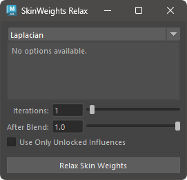
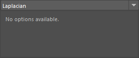
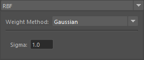
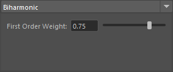
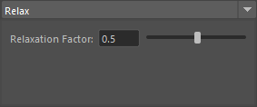

# Relax SkinWeights

Smooth and relax the weights.

## How to Use

Use the Skin Weights Utility menu or start the tool with the following command:

```python
import faketools.tools.skinWeights_relax
faketools.tools.skinWeights_relax.show_ui()
```



### Basic Usage

To smooth and relax the weights, follow these steps:

1. Select the components.
2. Choose the type of smoothing from the top menu.
3. Set the options.
4. Press the `Relax Skin Weights` button.

### Types of Smoothing

#### Laplacian

Smooth the weights using Laplacian smoothing.



Laplacian smoothing averages the weights of the selected components with their adjacent components.

#### RBF

Smooth the weights using RBF smoothing.



RBF smoothing smooths the weights of the selected components based on their positions. You can choose from Gaussian, Linear, or Inverse Distance weighting functions.

- Gaussian
  - Smooth the weights using a Gaussian function. The smaller the Sigma, the higher the smoothing degree.
- Linear
  - Smooth the weights using a linear weighting function.
- Inverse Distance
  - Smooth the weights based on the inverse distance. The larger the Power, the higher the smoothing degree.

#### Biharmonic

Smooth the weights using Biharmonic smoothing.



Unlike other smoothing methods that smooth weights based on adjacent vertices, Biharmonic smoothing smooths weights based on vertices adjacent to the adjacent vertices. The First Order Weight sets the weighting for the adjacent vertices. The weight used for the adjacent of the adjacent is 1.0 - First Order Weight.

#### Relax

Smooth the weights using Relax smoothing.



Relax smoothing, like Laplacian smoothing, averages the weights of the selected components with their adjacent components. You can set the ratio of the weights to be averaged using the Relaxation Factor.

### Options

- **Iterations**
  - Set the number of smoothing iterations. The more iterations, the smoother the weights.
- **After Blend**
  - Set the ratio to blend the original weights with the smoothed weights after smoothing. 0.0 is the original weight, and 1.0 is the smoothed weight.
- **Use Only Unlocked Influences**
  - Smooth using only unlocked influences. This is a somewhat experimental feature.
