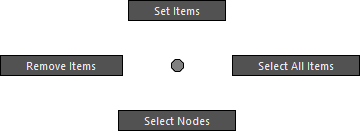
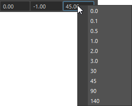

# **Remote Slider**

Operate the attributes of a transform node from the UI.


## How to Use

Launch from the dedicated menu or the following command:

```python
import faketools.tools.remote_slider
faketools.tools.remote_slider.show_ui()
```

### Basic Usage


1. Select the node you want to manipulate with the tool. Only transform-type nodes are valid.
2. Move the cursor to the node list at the top of the tool and register the node in the list via right-click **[ Set Items ]**.
3. Select the registered node name and the target attribute from the attribute list at the bottom, and manipulate the value using the slider.

### About Each Mode


From the **[ Edit ]** menu, you can choose how to manipulate the values with the slider. The following modes are available:

- **Local Relative Mode**
  - Adds the slider's value to the current value in the node's local space.
  - The current value at the time of registration in the tool is recorded internally (not visible to the user). This value is also used when the **[ Reset ]** button is executed.

- **Local Absolute Mode**
  - Directly assigns the slider's value in the node's local space.
  - The **[ Reset ]** button sets the value to 0 for translate/rotate or 1 for scale.

- **World Relative Mode**
  - Adds the slider's value to the current value in the node's world space.
  - In this mode, only one attribute can be selected, and the scale attribute cannot be selected.
  - The **[ Reset ]** button restores all three values of the attribute to their original positions. For example, if translateX is selected and **[ Reset ]** is executed, the values of translateY and Z are also reset to the state at the time of node registration.

The **values** used during slider operation and on **[ Reset ]** in Local Relative and World Relative Modes can be updated via **[ Update Reset Values ]**.

### Options

#### **Marking Menu**



This menu appears when you right-click on the node list. The functions are as follows:

- **Set Items**
  - Registers the selected transform node in the scene to the list.
- **Remove Items**
  - Removes the selected node from the list.
- **Select All Items**
  - Selects all nodes in the node list.
- **Select Nodes**
  - Selects the nodes in the scene that are selected in the node list.

#### **Step Buttons**

The `+` and `-` **[ Step ]** buttons increase or decrease the slider's value by a fixed amount. The value changes depending on how you click the button:

- Clicking without any modifier keys
  - Uses a value of 1.0.
- Clicking while holding the Shift key
  - Uses a value of 10.0.
- Clicking while holding the Ctrl key
  - Uses a value of 0.1.

#### Numeric Fields

The numeric fields aligned below the slider indicate the minimum value, current value, and maximum value from left to right. Each field allows direct input of values.



You can also select frequently used values by right-clicking on the minimum or maximum value fields.
