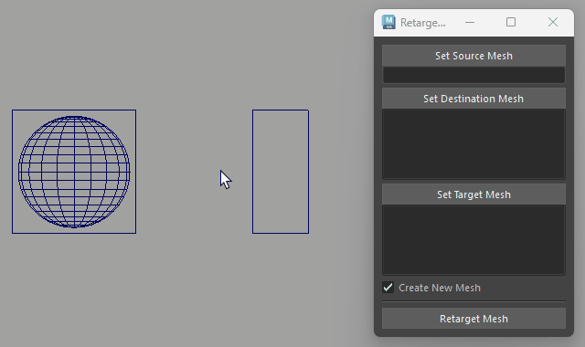
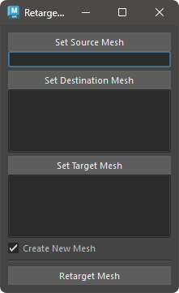

# Retarget Mesh

ジオメトリの変形を別のジオメトリに適用するツールです。

 

## 概要

ソースメッシュ と デスティネーションメッシュ の変形差分を ターゲットメッシュ に適用します。
デスティネーションメッシュ と ターゲットメッシュ は複数選択可能です。

## 使用方法

専用のメニューか、以下のコマンドでツールを起動します。

```python
import faketools.retarget_mesh_ui
faketools.retarget_mesh_ui.show_ui()
```

 

### 基本的な使用方法

ツールを使用するには、以下の手順を行います。

1. 変形に使用する元のジオメトリを選択し、`Set Source Mesh` ボタンを押します。
2. 変形に使用する先のジオメトリを選択し、`Set Destination Mesh` ボタンを押します ( 複数選択可能 )。
3. 変形するジオメトリを選択し、`Set Target Mesh` ボタンを押します。
4. `Retarget Mesh` ボタンを押します。

### オプション

- **Create New Mesh**
  - チェックボックスがオンの場合、新しいジオメトリを作成します。オフの場合、ターゲットメッシュが変形します。

## 注意事項

- ソースメッシュ と デスティネーションメッシュ のトポロジーは同じである必要があります。
- `Create New Mesh` がオフで デスティネーションメッシュ が複数の場合は、作成されません。
- ターゲットメッシュの頂点数が多い場合の処理は、時間がかかる可能性があります。
