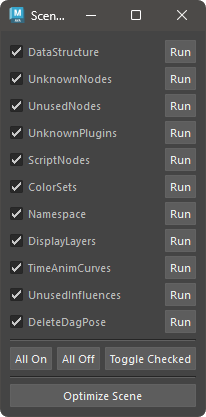

# Scene Optimizer

Optimize the scene.

## How to Use

Launch from the dedicated menu or the following command:

```python
import faketools.tools.scene_optimizer
faketools.tools.scene_optimizer.show_ui()
```



The text next to each checkbox describes the optimization content. To execute individually, press the **RUN** button.

To execute all at once, press the **Optimize Scene** button. Only the checked processes will run.

## Optimization Contents

### DataStructure

Remove all DataStructure present in the scene.

### UnknownNodes

Remove all unknown nodes present in the scene.

### UnusedNodes

Remove all unused nodes present in the scene.

### UnknownPlugins

Remove all unknown plugins present in the scene.

### ScriptNodes

Remove all script nodes present in the scene.

### ColorSets

Remove all color sets present in the scene.

### DisplayLayers

Remove all display layers present in the scene.

### TimeAnimCurves

Remove all time-dependent animation curves present in the scene.

### UnusedInfluences

Remove all unused influences present in the scene.
