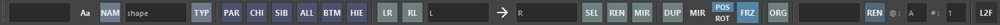
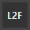

# Selecter

A tool to assist with selection and name substitution in Maya.



## Overview

This tool assists with operations such as selecting nodes in the scene and substituting names.

Main features include:

- Filtering selected nodes by name or node type
- Selecting parents, children, and siblings of selected transform nodes
- Selecting, renaming, duplicating, and duplicating original shapes of nodes by substituting names
- Renaming selected nodes

## Usage

Launch the tool from the dedicated menu or with the following command.
The launched tool will dock at the bottom of the shelf.

```python
import faketools.tools.selecter
faketools.tools.selecter.show_ui()
```

### Filter Selection by Name

Filter selected nodes by text.
Holding down the `Ctrl` key while selecting will deselect the matching nodes.

**Example: Select nodes containing the text "Group"**  


If a regular expression string is used, it will be filtered as a regular expression.

**Example: Select nodes containing the text "Group" at the end of the node name**  


Pressing the `Aa` button will filter without case sensitivity.


### Filter Selection by Node Type

Filter selected nodes by node type.
Holding down the `Ctrl` key while selecting will deselect the matching nodes.


### Select Parent, Child, and Sibling Nodes

Select the parent, child, and sibling nodes of the selected nodes.


- **PAR**
  - Select the parent of the selected nodes.
- **CHI**
  - Select the children of the selected nodes.
- **SIB**
  - Select the siblings of the selected nodes.
- **ALL**
  - Select all parents, children, and siblings of the selected nodes.
- **BTM**
  - Select the bottom nodes of the selected node hierarchy.
- **HIE**
  - Select all nodes including shape nodes of the selected nodes.

All selections can use modifier keys just like in Maya's view.

### Select by Substituting Names (Left to Right)

Select nodes by substituting the names of the selected nodes from left to right.


All selections can use modifier keys just like in Maya's view.

※ This feature can be customized by setting `LEFT_TO_RIGHT` and `RIGHT_TO_LEFT` in settings.json.

### Select, Rename, Duplicate, and Duplicate Original Shapes by Substituting Names

Select, rename, duplicate, and duplicate original shapes of nodes by substituting names.


The command is executed by substituting the names with the strings entered in each text box. Pressing the **→** button will swap the direction of substitution.


- **SEL**
  - Select nodes by substituting names.
- **REN**
  - Rename nodes by substituting names.
- **DUP**
  - Duplicate nodes by substituting names. Pressing the **MIR** button will mirror the nodes. **POS** and **ROT** determine whether to mirror the position and rotation, respectively. If the **FRZ** button is pressed, the transform and pivot will be frozen after mirroring. For mesh nodes, components will also be frozen.
- **ORG**
  - Duplicate original shapes by substituting names.

### Rename Selected Nodes

Rename the selected nodes.


- Strings starting with `@` will be converted to alphabets. They will be assigned sequentially from A based on the selection order. To change the initial string, modify the string in the @ field.
- Strings starting with `#` will be converted to numbers. They will be assigned sequentially from 1 based on the selection order. To change the initial number, modify the string in the # field.
- Strings starting with `~` will be replaced with the names of the selected nodes.

**Example:**

| Selected Nodes | Field | Rename Result |
|:---|:---| :---|
| Any | fake@ | fakeA, fakeB, fakeC, ... |
| Any | fake# | fake1, fake2, fake3, ... |
| Any | ~_fake | Any_fake |

### Special Features

Use the special features by pressing the respective buttons.



- **L2F**
  - Change the last selected node to the first selected node.


