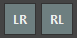
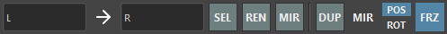

# Selecter

A tool to assist with selection and renaming operations.


## Overview

This tool assists with selecting nodes in the scene and renaming operations.

Key features include:

- Filtering selected nodes by name or node type.
- Selecting parent, child, or sibling transform nodes of the selected nodes.
- Renaming, duplicating, or duplicating original shapes by replacing selected node names.
- Changing the names of selected nodes.

## How to Use

Launch from the dedicated menu or the following command. The tool will dock at the bottom of the shelf.

```python
import faketools.tools.selecter
faketools.tools.selecter.show_ui()
```

### Filtering Selection by Name

Filters selected nodes using regular expressions.


Selecting the .* icon on the left changes it to ^, and selecting the .* icon on the right changes it to $. Selecting the Aa icon distinguishes between uppercase and lowercase.

Hold the `Ctrl` key while selecting to deselect matching nodes.

### Filtering Selection by Node Type

Filters selected nodes by node type.


Hold the `Ctrl` key while selecting to deselect matching nodes.

### Selecting Parent, Child, or Sibling Nodes

Selects parent, child, or sibling nodes of the selected nodes.


- **PAR**: Selects the parent of the selected node.
- **CHI**: Selects the child of the selected node.
- **SIB**: Selects the siblings of the selected node.
- **ALL**: Selects the parent, child, and siblings of the selected node.
- **BTM**: Selects the lowest-level nodes in the hierarchy of the selected nodes.
- **HIE**: Selects all nodes, including shape nodes, of the selected nodes.

All these options can use modifier keys similar to Maya's viewport selection.

### Selecting by Replacing Names (Left and Right)

Selects nodes by replacing names with those set in the tool. 



Modifier keys can also be used, similar to Maya's viewport selection.

※ This feature can change the replacement method according to the settings of `LEFT_TO_RIGHT` and `RIGHT_TO_LEFT` in settings.json.

### Selecting, Renaming, Duplicating, or Duplicating Original Shapes by Replacing Names

Replaces the names of selected nodes to execute selection, renaming, duplication, or duplicating original shapes.



Commands execute using strings entered in the respective text boxes. Press the **→** button to swap the replacement direction.


- **SEL**: Replaces the names of selected nodes and selects them.
- **REN**: Replaces the names of selected nodes and renames them.
- **DUP**: Replaces the names of selected nodes and duplicates them. Press the **MIR** button for mirroring. Use **POS** and **ROT** to decide whether to mirror position and rotation, respectively. If the **FRZ** button is pressed, the transform and pivot will freeze after mirroring. For mesh nodes, components are also frozen.
- **ORG**: Replaces the names of selected nodes and duplicates the original shape.

### Renaming Selected Nodes

Changes the names of selected nodes.


- Strings starting with `@` are converted to alphabets. They are assigned in order of selection, starting with A. Change the first string using the @ field.
- Strings starting with `#` are converted to numbers. They are assigned in order of selection, starting with 1. Change the first number using the # field.
- Strings starting with `~` are replaced with the names of the selected nodes.

### Special Functions

Special functions are available by pressing the respective buttons.


- **L2F**: Changes the last selected node to the first selected node.
