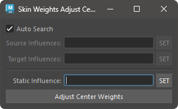
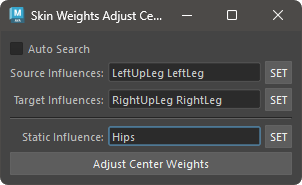

# Adjust SkinWeights Center

主に中央位置にある頂点のウエイトを調整します。

## 概要

主に中央位置にある頂点のウエイトを調整します。ここで「中央位置」とは、ジオメトリの左右対称軸上に位置する頂点を指します。

「調整」とは、中心位置に対して左右の意味合いを持つインフルエンスのウエイト値を同じ値にすることを指します。例えば、spine と shoulder の左右のインフルエンスの三つのインフルエンスが中心の頂点に対してそれぞれ 0.4, 0.2, 0.4 のウエイトを持っている場合、このツールを使用することで、それぞれ 0.4, 0.3, 0.3 に調整されます。


## 使用方法

Skin Weights Utility のメニューを使用するか、以下のコマンドでツールを起動します。

```python
import faketools.tools.skinWeights_adjust_center_ui
faketools.tools.skinWeights_adjust_center_ui.show_ui()
```



### 基本的な使用方法

ウエイトを調整するには、以下の手順を行います。

#### Auto Search が有効な場合

`Auto Search` が有効な場合、選択されている頂点のスキンクラスターから、ペアとなるインフルエンスを自動的に検索します。  
自動的な検索は、`settings.json` に記述された `ADJUST_CENTER_WEIGHT` より正規表現にて検索されます。

#### Auto Search が無効な場合




1. `Source Influences` に左右どちらかのインフルエンス（複数可）を選択し `SET` ボタンを押します。
2. `Target Influences` に `Source Influences` とペアになるインフルエンスを選択し `SET` ボタンを押します。
3. `Adjust Center Weights` ボタンを押します。

`Static Influence` にインフルエンスが登録されていない場合、ソースインフルエンスとターゲットインフルエンスのペアの平均値が設定されます。

一方、`Static Influence` にインフルエンスが登録されている場合は、ソースインフルエンスのウエイト値がターゲットインフルエンスに適用されます。この結果、すべてのインフルエンスのウエイト値の合計が 1.0 を超える場合は、その差分が Static Influence から差し引かれます。
