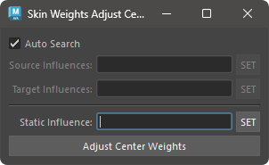

# Adjust SkinWeights Center

Adjust the weights of vertices mainly located at the center position.

## Overview

Adjust the weights of vertices mainly located at the center position. Here, "center position" refers to vertices located on the symmetrical axis of the geometry.

"Adjustment" refers to making the weights of influences with left-right meanings the same value with respect to the center position. For example, if three influences, spine and shoulders (left and right), have weights of 0.4, 0.2, and 0.4 respectively on a central vertex, using this tool will adjust them to 0.4, 0.3, and 0.3.

## How to Use

Use the Skin Weights Utility menu or start the tool with the following command:

```python
import faketools.tools.skinWeights_adjust_center_ui
faketools.tools.skinWeights_adjust_center_ui.show_ui()
```



### Basic Usage

To adjust the weights, follow these steps:

1. Select one or more influences for either the left or right side in `Source Influences` and press the `SET` button.
2. Select the influences paired with `Source Influences` in `Target Influences` and press the `SET` button.
3. Press the `Adjust Center Weights` button.

If no influences are registered in `Static Influence`, the average value of the source and target influence pairs will be set.

On the other hand, if influences are registered in `Static Influence`, the weight value of the source influence will be applied to the target influence. As a result, if the total weight value of all influences exceeds 1.0, the difference will be subtracted from the Static Influence.
