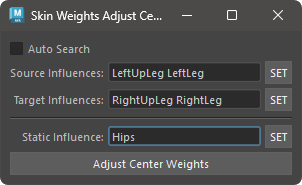

# Adjust SkinWeights Center

### Basic Usage

To adjust the weights, follow these steps:

#### When Auto Search is enabled

If `Auto Search` is enabled, the tool will automatically search for paired influences from the skin cluster of the selected vertices.  
The automatic search is performed using regular expressions specified in `settings.json` under `ADJUST_CENTER_WEIGHT`.

#### When Auto Search is disabled

1. Select one or more influences for either the left or right side in `Source Influences` and press the `SET` button.
2. Select the paired influences for `Source Influences` in `Target Influences` and press the `SET` button.
3. Press the `Adjust Center Weights` button.

If no influences are registered in `Static Influence`, the average value of the source and target influence pairs will be set.

If influences are registered in `Static Influence`, the weight value of the source influence will be applied to the target influence. If the total weight value of all influences exceeds 1.0 as a result, the difference will be subtracted from the Static Influence.
