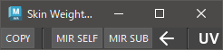

# SkinWeights Bar

ウエイトのコピーとミラーリングを行います。


## 使用方法

Skin Weights Utility の上部分を使用するか、以下のコマンドでツールを起動します。

```python
import faketools.tools.skinWeights_bar_ui
faketools.tools.skinWeights_bar_ui.show_ui()
```



### 基本的な使用方法

#### Copy

ウエイトコピーを行います。

1. コピー元のジオメトリを選択します。
2. コピー先のジオメトリ（複数選択可）を選択します。
3. `COPY` ボタンを押して、コピー元のウエイトをコピー先にコピーします。この時 UV を参照する際は、`UV` チェックボックスをオンにしてください。

このツールは、コピー元のジオメトリに設定されているインフルエンスを強制的にコピー先ジオメトリの skinCluster に追加します。

### Mirror Self

ウエイトのミラーリングを行います。

1. ジオメトリを選択します。
2. `MIR SELF` ボタンを押して、選択したジオメトリのウエイトをミラーリングします。この時、ミラーリングする方向を矢印ボタンで選択してください。`<-` の場合は、X から -X に、`->` の場合は -X から X にミラーリングします。
   
このツールは、選択したジオメトリに設定されている左右のインフルエンスを検索し、見つかったインフルエンスと反対側のインフルエンスが存在する場合、そのインフルエンスを強制的に skinCluster に追加します。

※ この機能での反対側のインフルエンスの取得方法は、settings.json の `LEFT_TO_RIGHT` 及び `RIGHT_TO_LEFT` の設定によって決定しています。

### Mirror Sub

ウエイトのミラーリングを別ジオメトリに対して行います。

使用例：例えば、靴を履いているキャラクターの左右の靴のウエイトをミラーリングする場合などに使用します。

1. 左側の靴のジオメトリを選択します。
2. `MIR SUB` ボタンを押します。この時の実行される手順は以下の通りです。
   1. 左側の靴のジオメトリ名から右側の靴のジオメトリ名を生成します。
   2. 右側の靴のジオメトリが見つかった場合、左側の靴のジオメトリに設定されているインフルエンス名を左から右の名前に変換します。
   3. 右側の靴のジオメトリに変換されたインフルエンス名が存在する場合、そのインフルエンスを強制的に skinCluster に追加するか、新たに skinCluster を作成して追加します。
   4. 左側の靴のジオメトリに設定されているウエイトを右側の靴のジオメトリにコピーします。

※ 反対側のジオメトリやインフルエンスを検索する方法は、Mirror Self と同様です。