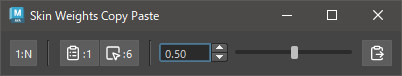
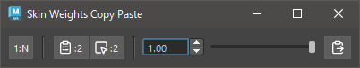

# SkinWeights Copy Paste

Copy and paste skinCluster weights on a per-component basis.

## How to Use

Use the Skin Weights Utility menu or start the tool with the following command:

```python
import faketools.tools.skinWeights_copy_paste_ui
faketools.tools.skinWeights_copy_paste_ui.show_ui()
```


### Basic Usage

To copy and paste weights, follow these steps:

**Copying from a single component to multiple components**



1. Set the first button to `1:N`.
2. Select the source component and click the second button. The source component will be remembered. Multiple components can be remembered, but the first selected one will be used as the source.
3. Select the target components and click the third button. The target components will be remembered.
4. Use the spin box or slider to blend and adjust the weights from the source to the target. Alternatively, use the rightmost button to paste the source weights directly to the target.

**Copying between selected components one-to-one**



1. Set the first button to `1:1`.
2. Select the source component and click the second button. The source component will be remembered.
3. Select the same number of target components as the source and click the third button. The target components will be remembered.
4. Use the spin box or slider to blend and adjust the weights from the source to the target. Alternatively, use the rightmost button to paste the source weights directly to the target.

※ Selecting too many components may cause the process to become slow.

### Optional Features

The up and down arrows of the spin box can be clicked while holding the Ctrl key to change in increments of 0.01. Additionally, holding the Shift key while clicking will change in increments of 0.5.
