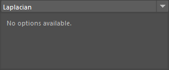
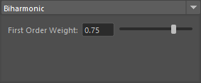
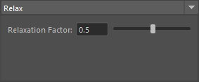

# Relax SkinWeights

ウエイトをスムース、リラックスさせます。

## 使用方法

専用のメニューか、以下のコマンドでツールを起動します。

```python
import faketools.tools.skinWeights_relax
faketools.tools.skinWeights_relax.show_ui()
```


### 基本的な使用方法

ウエイトをスムース、リラックスさせるには、以下の手順を行います。

1. コンポーネントを選択します。
2. 上部のメニューからスムースの種類を選択します。
3. オプションを設定します。
4. `Relax Skin Weights` ボタンを押します。

### スムースの種類

#### Laplacian

Laplacian スムースを使用してウエイトをスムースします。



Laplacian スムースは、選択したコンポーネントの隣接するコンポーネントのウエイトを平均化します。

#### RBF

RBF スムースを使用してウエイトをスムースします。


RBF スムースは、選択したコンポーネントのウエイトを、選択したコンポーネントの位置に基づいてスムースします。
位置に対しての重み付け関数は、Gaussian、Linear、Inverse Distance のいずれかを選択できます。

- Gaussian
  - ガウス関数を使用してウエイトをスムースします。Sigma が小さいほど、ウエイトのスムース度が高くなります。
- Linear
  - 重み付け関数を線形に設定してウエイトをスムースします。
- Inverse Distance
  - 距離の逆数に基づいてウエイトをスムースします。Power が大きいほど、ウエイトのスムース度が高くなります。

#### Biharmonic

Biharmonic スムースを使用してウエイトをスムースします。



他のスムース方法が、隣接する頂点を基準にウエイトをスムースするのに対して、Biharmonic スムースは、隣接した頂点のさらに隣接した頂点を基準にウエイトをスムースします。First Order Weight は、隣接した頂点のウエイトに対する重み付けを設定します。隣接の隣接に使用されるウエイトは、1.0 - First Order Weight になります。


#### Relax

Relax スムースを使用してウエイトをスムースします。



Relax スムースは Laplacian スムースと同様に、選択したコンポーネントの隣接するコンポーネントのウエイトを平均化します。
平均化する際のウエイトの割合を設定できます。割合は、Relaxation Factor で設定します。

### オプション

- **Iterations**
  - スムースの反復回数を設定します。反復回数が多いほど、ウエイトがスムースされます。
- **After Blend**
  - スムース後に、元のウエイトとスムース後のウエイトをブレンドする割合を設定します。0.0 で元のウエイト、1.0 でスムース後のウエイトになります。
- **Use Only Unlocked Influences**
  - ロックされていないインフルエンスのみを使用してスムースします。すこし実験的な機能です。