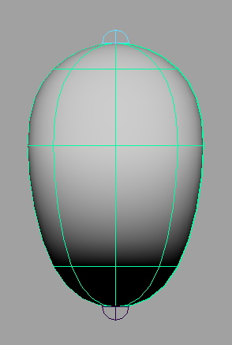
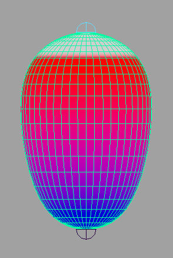
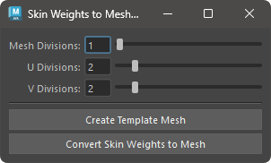

# SkinWeights to Mesh

skinCluster が設定されているジオメトリをウエイトを保持したまま別のメッシュとして複製します。



## 概要

skinCluster が適用されたジオメトリを、ウエイト情報を保持した状態で別のメッシュに複製します。複製元のジオメトリは、メッシュまたは NURBS サーフェースである必要があります。

**メッシュの場合**  
メッシュの場合は、polySmoothFace ノードを使用し、ディビジョンを追加した状態でウエイト情報を保持して複製します。

**NURBS サーフェースの場合**  
NURBS サーフェースの場合は、nurbsTessellate ノードを使用し、ディビジョンを調整した状態のジオメトリをウエイト情報を保持して複製します。

## 使用方法

Skin Weights Utility のメニューを使用するか、以下のコマンドでツールを起動します。

```python
import faketools.tools.skinWeights_to_mesh
faketools.tools.skinWeights_to_mesh.show_ui()
```



### 基本的な使用方法

複製するには、以下の手順を行います。

1. skinCluster が設定されたジオメトリを選択（複数選択可）します。
2. 選択しているジオメトリがメッシュの場合は、`Mesh Division` を NURBS サーフェースの場合は、`U Division` と `V Division` を設定します。
3. `Convert Skin Weights to Mesh` ボタンを押します。

`Create Template Mesh` ボタンを押すことにより、複製後のメッシュのプレビューとなるジオメトリが作成されます。プレビュー状態では、各ディビジョンの値をUI上から変更することができます。