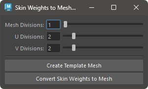

# SkinWeights to Mesh

Duplicate geometry with a skinCluster applied while retaining the weights as a separate mesh.


## Overview

Duplicate geometry with a skinCluster applied to another mesh while retaining the weight information. The source geometry must be either a mesh or a NURBS surface.

**For Meshes**  
For meshes, use the polySmoothFace node to add divisions and duplicate while retaining the weight information.

**For NURBS Surfaces**  
For NURBS surfaces, use the nurbsTessellate node to adjust the divisions and duplicate the geometry while retaining the weight information.

## How to Use

Use the Skin Weights Utility menu or start the tool with the following command:

```python
import faketools.tools.skinWeights_to_mesh_ui
faketools.tools.skinWeights_to_mesh_ui.show_ui()
```



### Basic Usage

To duplicate, follow these steps:

1. Select the geometry with a skinCluster applied (multiple selections allowed).
2. If the selected geometry is a mesh, set `Mesh Division`. If it is a NURBS surface, set `U Division` and `V Division`.
3. Press the `Convert Skin Weights to Mesh` button.

By pressing the `Create Template Mesh` button, a geometry preview of the duplicated mesh will be created. In the preview state, you can change the division values from the UI.