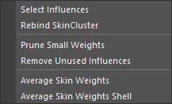

# SkinWeights Tools

skinCluster のウエイトを編集するためのツールです。

## 概要と注意事項

このツールは、いくつかのツールを内包しています。
また、skinCluster の method が Classic Linear であることを想定しており他の method には対応していません。

## 使用方法

専用のメニューか、以下のコマンドでツールを起動します。

```python
import faketools.tools.skinWeights_tools_ui
faketools.tools.skinWeights_tools_ui.show_ui()
```


### Edit メニュー



- **Select Influences**
  - ジオメトリ及び頂点（複数オブジェクト選択可）を選択し実行すると、それに設定されている skinCluster のインフルエンスを選択します。
  - 頂点を選択した場合は、その頂点でウエイトが 0 以上のインフルエンスのみを選択します。
- **Rebind SkinCluster**
  - ジオメトリ及び頂点（複数オブジェクト選択可）を選択し実行すると、それに設定されている skinCluster をそのインフルエンスの位置で再バインドします。
- **Prune Small Weights**
  - ジオメトリを選択し実行すると、ウエイトが 0.005 未満のインフルエンスのウエイトを 0 に設定します。Maya の標準機能と違い、ロックされているインフルエンスを無視します。
- **Remove Unused Influences**
  - ジオメトリ（複数選択可）を選択し実行すると、ウエイトがすべて 0 のインフルエンスをその skinCluster から除外します。
- **Average Skin Weights**
  - 頂点を選択し実行すると、選択された頂点のウエイトを平均化します。
- **Average Skin Weights Shell**
  - ジオメトリを選択し実行すると、選択されたジオメトリのウエイトをシェルごとに平均化します。

### ツール

- [SkinWeights Bar](skinWeights_bar.html)
  - ウエイトのコピーとミラーリングを行います。
- [Copy SkinWeights Custom](copySkinWeights_custom.html)
  - ウエイトのコピーをオプションを指定して行います。
- [SkinWeights to Mesh](skinWeights_to_mesh.html)
  - skinCluster が設定されているジオメトリをウエイトを保持したままディビジョンを追加した状態で複製します。
- [Adjust Center Weights](skinWeights_adjust_center.html)
  - 主に、真ん中の頂点のウエイトを調整します。
- [Combine SkinWeights](skinWeights_combine.html)
  - ウエイトを複数のインフルエンスから一つのインフルエンスに統合します。
- [Influence Exchange](influence_exchanger.html)
  - 既にバインドされているインフルエンスをバインドされていないインフルエンスに交換します。

