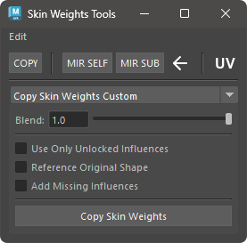

# SkinWeights Utility

A tool for editing skinCluster weights.

## Overview and Notes

This tool includes several functionalities.  
It assumes that the skinCluster method is set to Classic Linear and does not support other methods.

## How to Use

Launch the tool using the dedicated menu or by executing the following command:

```python
import faketools.tools.skinWeights_tools_ui
faketools.tools.skinWeights_tools_ui.show_ui()
```



### Edit Menu


- **Select Influences**  
  Select geometry and vertices (multiple objects supported), then run the command to select influences associated with the skinCluster.  
  If vertices are selected, only influences with weights greater than zero at the selected vertices are selected.

- **Rebind SkinCluster**  
  Select geometry and vertices (multiple objects supported), then run the command to rebind the skinCluster to the influence positions.  

- **Prune Small Weights**  
  Select vertices and run the command to set the weights of influences below 0.005 to zero. Unlike Maya's standard feature, locked influences are ignored.  

- **Remove Unused Influences**  
  Select geometry (multiple objects supported) and run the command to remove influences with zero weight from the skinCluster.  

- **Average Skin Weights**  
  Select vertices and run the command to average the weights of the selected vertices.  

- **Average Skin Weights Shell**  
  Select geometry and run the command to average skin weights for each shell of the selected geometry.  

### Tools

- [SkinWeights Bar](skinWeights_bar_en.html)  
  Copy and mirror weights.  

- [Copy SkinWeights Custom](copySkinWeights_custom_en.html)  
  Copy weights with specific options.  

- [SkinWeights to Mesh](skinWeights_to_mesh_en.html)  
  Duplicate geometry with added divisions while preserving skinCluster weights.  

- [Adjust Center Weights](skinWeights_adjust_center.html)  
  Adjust weights mainly for center vertices.  

- [Combine SkinWeights](skinWeights_combine.html)  
  Merge weights from multiple influences into one influence.  

- [Influence Exchange](influence_exchanger.html)  
  Swap bound influences with unbound ones.
