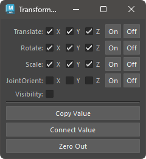

# Transform Connecter

Transform ノードを接続、値のコピー、ゼロリセットを行うツールです。


## 使用方法

専用のメニューか、以下のコマンドでツールを起動します。

```python
import faketools.tools.transform_connecter_ui
faketools.tools.transform_connecter_ui.show_ui()
```



### 基本的な使用方法

1. ツールで操作したいノードを選択します。トランスフォームタイプのノードのみが有効です。
2. それぞれ操作したいアトリビュートのチェックボックスを選択します。
3. それぞれ、Copy Value ( 値のコピー )、Connect Value ( 接続 )、Zero Reset ( ゼロリセット ) のボタンを押して操作を行います。
