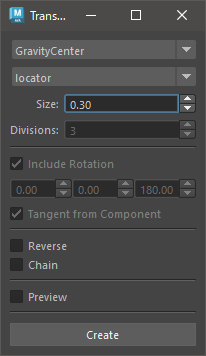

# Transform Creater

Creates transform nodes for selected nodes or components.

## How to Use

Launch from the dedicated menu or the following command:

```python
import faketools.tools.transform_creater_ui
faketools.tools.transform_creater_ui.show_ui()
```



### Basic Usage

1. Select the transform creation method from the dropdown menu at the top.
2. Select the transform node or component in the scene.
3. Configure the other options. Options that are not grayed out can be set.
4. Press the **[ Create ]** button to create the transform nodes.

※ Selectable components include Vertex, Edge, Face, CurveCV, CurveEP, and SurfaceCV.

### Options

- **Node Type**
  - Choose between locator or transform.
- **Divisions**
  - Valid only when the creation method is set to innerDivide. Specifies the number of divisions between selected nodes.
- **Include Rotation**
  - Determines whether the created transform nodes include rotation attributes.
- **Rotation Offset Value**
  - Sets the rotation offset value for the created transform nodes.
- **Tangent from Component**
  - For Vertex and Edge, the rotation is set by obtaining the tangent vector from the components connected to those components.
- **Reverse**
  - Reverses the order of the transform nodes if duplicated.
- **Chain**
  - Arranges duplicated transform nodes into a chain hierarchy.
- **Preview**
  - Displays a preview of the transform nodes to be created.

### Creation Methods

- **GravityCenter**
  - Creates transform nodes at the center of gravity of the selected nodes.
- **BoundingBoxCenter**
  - Creates transform nodes at the center of the bounding box of the selected nodes.
- **EachPositions**
  - Creates transform nodes at each position of the selected nodes.
- **InnerDivide**
  - Divides the space between the selected nodes and creates transform nodes at the intervals.
