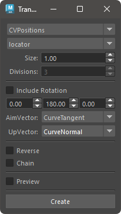

# Transform Creater on Curve

Creates transform nodes on the selected curve.

## How to Use

Launch from the dedicated menu or the following command:

```python
import faketools.tools.transform_creater_on_curve
faketools.tools.transform_creater_on_curve.show_ui()
```



### Basic Usage

1. Select the transform creation method from the dropdown menu at the top.
2. Select the nurbsCurve node and its transform node in the scene.
3. Configure the other options. Options that are not grayed out can be set.
4. Press the **[ Create ]** button to create the transform nodes.

### Options

- **Node Type**
  - Choose between locator or transform.
- **Divisions**
  - Valid only when the creation method is set to innerDivide. Specifies the number of divisions between selected nodes.
- **Include Rotation**
  - Determines whether the created transform nodes include rotation attributes.
- **Rotation Offset Value**
  - Sets the rotation offset value for the created transform nodes.
- **Aim Vector**
  - Specifies how to determine the aim vector of the created transform nodes.
    - **CurveTangent**
      - Uses the tangent vector of the curve.
    - **NextPoint**
      - Uses the vector towards the position of the next node in the sequence of created transform nodes.
    - **PreviousPoint**
      - Uses the vector towards the position of the previous node in the sequence of created transform nodes.
- **Up Vector**
  - Specifies how to determine the up vector of the created transform nodes.
    - **SceneUp**
      - Uses the scene's up vector, which is [0, 1, 0].
    - **CurveNormal**
      - Uses the normal vector of the curve.
    - **SurfaceNormal**
      - Uses the normal vector of the surface to which the curve belongs. The curve must be created using the duplicateCurve command; otherwise, CurveNormal is applied by default.
- **Reverse**
  - Reverses the order of the transform nodes if duplicated.
- **Chain**
  - Arranges duplicated transform nodes into a chain hierarchy.
- **Preview**
  - Displays a preview of the transform nodes to be created.

### Creation Methods

- **CVPositions**
  - Creates transform nodes at the positions of the curve's CVs.
- **EPPositions**
  - Creates transform nodes at the positions of the curve's edit points.
- **CVClosestPositions**
  - Creates transform nodes at positions on the curve closest to its CVs.
- **ParameterPositions**
  - Creates transform nodes at equally spaced parameter values on the curve. The number of nodes is determined by the Divisions setting.
- **LengthPositions**
  - Creates transform nodes at equal intervals along the curve's length. The number of nodes is determined by the Divisions setting.
- **CloudPositions**
  - Creates transform nodes at equal chord lengths along the curve. The number of nodes is determined by the Divisions setting.
  - If the target curve is closed, it is possible failed to create transform nodes. In that case, please use the open curve.
